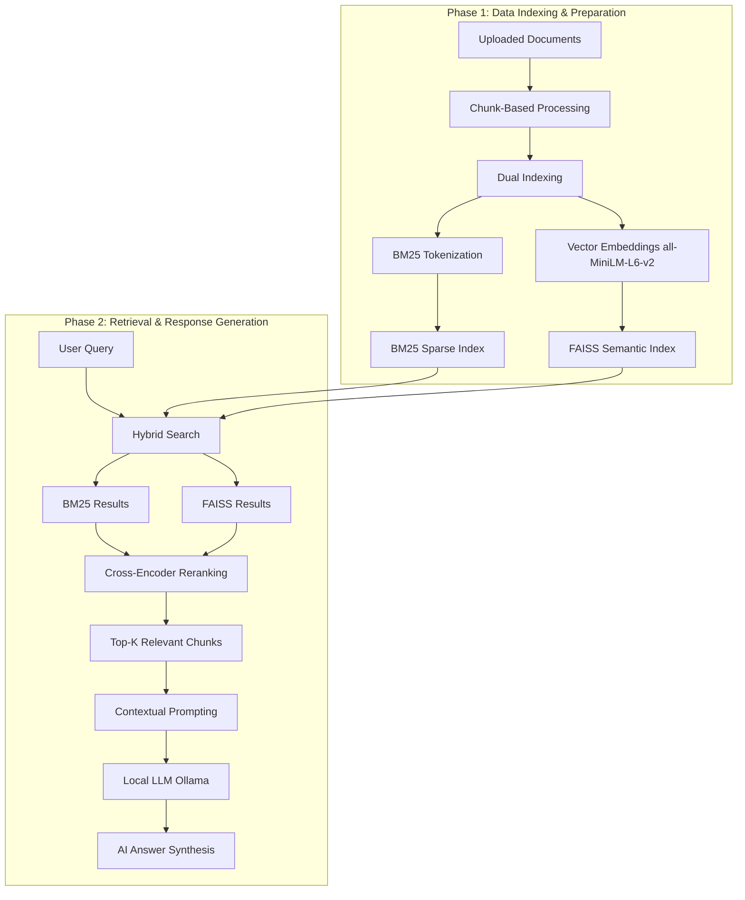

# Hybrid RAG Application

A advanced Retrieval-Augmented Generation (RAG) system that combines sparse and dense search techniques with cross-encoder reranking to provide accurate, context-aware answers using local LLMs.

## Overview

This application implements a hybrid RAG pipeline that leverages both keyword-based (BM25) and semantic (FAISS) search methods to retrieve relevant document chunks. The retrieved results are re-ranked using a cross-encoder model to ensure the most relevant context is passed to a local LLM for answer generation. The system is designed to run entirely locally, ensuring privacy and eliminating dependency on external API services.

The project addresses the limitation of single-method retrieval systems by combining multiple search strategies, reducing the chance of missing relevant information while improving retrieval accuracy through intelligent reranking.

## Features

- **Document Ingestion**: Upload text directly or via text files
- **Intelligent Chunking**: Automatic text segmentation with configurable overlap to maintain context
- **Dual Indexing**: 
  - Sparse indexing using BM25 for keyword-based retrieval
  - Dense indexing using FAISS for semantic similarity search
- **Document Management**: List and delete uploaded documents
- **Local LLM Integration**: Uses Ollama for private, on-device inference
- **RESTful API**: FastAPI-based backend for easy integration

## Architecture



## How It Works

### Phase 1: Data Indexing & Preparation

1. **Uploaded Documents**: Documents are initially uploaded via the `/upload` endpoint, either as raw text or text files

2. **Chunk-Based Processing**: The uploaded text is split into smaller chunks (500 characters with 100-character overlap) to improve retrieval precision and maintain context relevance across chunk boundaries

3. **Dual Indexing (Sparse & Dense)**:
   - **BM25 Sparse Index**: Documents are tokenized and indexed for keyword-based search using the BM25 algorithm
   - **FAISS Dense Index**: Documents are converted into 384-dimensional vector embeddings using the pre-trained `all-MiniLM-L6-v2` model, which transforms text into numerical vectors for semantic search
   - These embeddings are stored in a FAISS index for efficient similarity search

### Phase 2: Retrieval & Response Generation

1. **Hybrid Search & Reranking**:
   - **BM25 Results**: Sparse search retrieves top chunks based on exact keyword matching
   - **FAISS Results**: Dense search retrieves top chunks based on semantic similarity
   - Both result sets are combined and deduplicated
   - **Cross-Encoder Reranking**: The merged results are re-scored using the `cross-encoder/ms-macro-MiniLM-L-6-v2` model, which evaluates each query-document pair to identify the most relevant context

2. **Contextual Prompting (Top-K)**: The top-K most relevant document chunks (default: 2) are injected into the LLM prompt to ensure accurate, context-grounded responses

3. **Local LLM (Ollama) - LLM Answer Synthesis**: A local LLM running via Ollama (`deepseek-r1:1.5b`) generates a natural language response based strictly on the retrieved document context

4. **AI Answer Synthesis**: The final AI answer is synthesized and returned to the user along with the context used for transparency

## Tech Stack

| Category | Technology |
|----------|------------|
| **Language** | Python |
| **Web Framework** | FastAPI |
| **ASGI Server** | Uvicorn |
| **Sparse Search** | rank_bm25 |
| **Dense Search** | FAISS (CPU) |
| **Embeddings** | sentence-transformers (all-MiniLM-L6-v2) |
| **Reranking** | sentence-transformers (cross-encoder/ms-macro-MiniLM-L-6-v2) |
| **LLM** | Ollama (deepseek-r1:1.5b) |
| **Numerical Computing** | NumPy |
| **License** | MIT |

## Project Structure

```
RAG/
├── main.py              # FastAPI application with RAG pipeline
├── requirements.txt     # Python dependencies
├── LICENSE             # MIT License
├── .gitignore          # Git ignore rules
├── .venv/              # Virtual environment (not tracked)
└── README.md           # This file
```

### File Descriptions

- **main.py**: Core application containing the FastAPI app, document processing logic, indexing functions, hybrid search, reranking, and RAG endpoint
- **requirements.txt**: All Python package dependencies with pinned versions
- **LICENSE**: MIT license for the project
- **.gitignore**: Excludes virtual environment, cache files, and environment variables

## Installation

### Prerequisites

- Python 3.8 or higher
- Ollama installed and running locally
- Ollama model `deepseek-r1:1.5b` pulled (or modify code to use a different model)

### Setup Steps

1. **Clone the repository**
   ```bash
   git clone <repository-url>
   cd RAG
   ```

2. **Create a virtual environment**
   ```bash
   python -m venv .venv
   ```

3. **Activate the virtual environment**
   
   On Windows:
   ```bash
   .venv\Scripts\activate
   ```
   
   On macOS/Linux:
   ```bash
   source .venv/bin/activate
   ```

4. **Install dependencies**
   ```bash
   pip install -r requirements.txt
   ```

5. **Start Ollama** (if not already running)
   ```bash
   ollama serve
   ```

6. **Pull the required model** (if not already available)
   ```bash
   ollama pull deepseek-r1:1.5b
   ```

7. **Run the application**
   ```bash
   python main.py
   ```

   The server will start on `http://0.0.0.0:8000`

## API Endpoints

### Upload Document

**Endpoint**: `POST /upload`

**Description**: Upload text or a text file to be indexed

**Request Body** (form-data):
- `text` (optional): Raw text string
- `file` (optional): Text file

**Response**: JSON with chunk count and total documents

**Example**:
```bash
curl -X POST "http://localhost:8000/upload" -F "text=Your document text here"
```

### Delete All Documents

**Endpoint**: `GET /delete`

**Description**: Clear all uploaded documents and reset indexes

**Response**: JSON with count of cleared documents

**Example**:
```bash
curl -X GET "http://localhost:8000/delete"
```

### List Documents

**Endpoint**: `GET /list/documents`

**Description**: Retrieve all currently stored document chunks

**Response**: JSON with total count and document list

**Example**:
```bash
curl -X GET "http://localhost:8000/list/documents"
```

### RAG Search

**Endpoint**: `POST /rag/search`

**Description**: Perform hybrid search and generate answer using LLM

**Request Body** (JSON):
```json
{
  "query": "Your question here"
}
```

**Response**: JSON with query, generated answer, and context used

**Example**:
```bash
curl -X POST "http://localhost:8000/rag/search" -H "Content-Type: application/json" -d "{\"query\": \"What is the main topic?\"}"
```

## Search Strategy Comparison

| Search Method | Best For | How It Works |
|--------------|----------|--------------|
| **Sparse Search (BM25)** | Exact keyword matching and literal terminology | Uses tokenization and term frequency-inverse document frequency (TF-IDF) to find documents containing the exact query terms |
| **Dense Search (FAISS)** | Finding conceptual matches even without shared keywords | Converts text to vector embeddings and finds semantically similar documents using cosine similarity in vector space |

The hybrid approach combines both methods to capture both exact matches and semantic relationships, ensuring comprehensive retrieval.

## Configuration

### Models Used

- **Embedding Model**: `all-MiniLM-L6-v2` (384-dimensional embeddings)
- **Cross-Encoder**: `cross-encoder/ms-macro-MiniLM-L-6-v2` (for reranking)
- **LLM**: `deepseek-r1:1.5b` (via Ollama)

### Chunking Parameters

- **Chunk Size**: 500 characters
- **Overlap**: 100 characters

### Retrieval Parameters

- **BM25 Top K**: 2 documents
- **FAISS Top K**: 2 documents
- **Reranker Top K**: 2 documents

These parameters can be modified in `main.py` to suit different use cases.

## Environment Variables

Currently, the application does not require any environment variables. All configuration is done directly in the code.

If you wish to use a different Ollama model, modify the `model` parameter in the `ollama.chat()` call in `main.py` (line 165).

## Usage Example

1. **Start the server**
   ```bash
   python main.py
   ```

2. **Upload a document**
   ```bash
   curl -X POST "http://localhost:8000/upload" -F "text=Artificial intelligence is transforming industries worldwide. Machine learning, a subset of AI, enables computers to learn from data. Deep learning uses neural networks with multiple layers to process complex patterns."
   ```

3. **Perform a search**
   ```bash
   curl -X POST "http://localhost:8000/rag/search" -H "Content-Type: application/json" -d "{\"query\": \"What is machine learning?\"}"
   ```

4. **Expected Response**
   ```json
   {
     "query": "What is machine learning?",
     "answer": "Based on the context, machine learning is a subset of AI that enables computers to learn from data.",
     "context": ["Machine learning, a subset of AI, enables computers to learn from data."]
   }
   ```

## Future Improvements

- **Persistent Storage**: Currently documents are stored in-memory; adding database persistence would allow data to survive server restarts
- **Async Processing**: Implement async document processing for large files
- **Batch Upload**: Support uploading multiple documents at once
- **Configuration File**: Move configuration to a separate config file or environment variables
- **Additional LLM Support**: Add support for other local LLM providers or OpenAI
- **Frontend Interface**: Build a web UI for easier interaction
- **Streaming Responses**: Implement streaming for LLM responses
- **Metadata Support**: Add document metadata (source, timestamp, etc.)
- **Advanced Chunking**: Implement semantic chunking or recursive chunking strategies
- **Evaluation Metrics**: Add retrieval and generation quality metrics

## License

This project is licensed under the MIT License - see the [LICENSE](LICENSE) file for details.

## Contributing

Contributions are welcome! Please feel free to submit a Pull Request.


